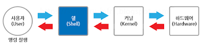
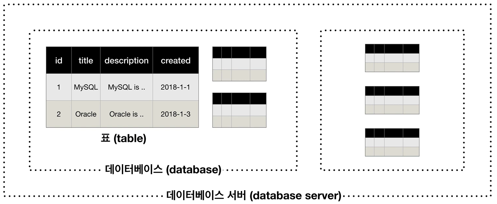

# 부스트코스 웹개발프로그래밍(풀스택)


# 목차
- [프로젝트 소개](#🖥️-프로젝트-소개)
- [학습일지](#학습일지-목차로-이동)
    - [마크다운 (Markdown)](#마크다운-markdown-목차로-이동)
    - [HTML과 CSS](#html과-css-목차로-이동)
    - [Web개발의 이해](#web개발의-이해-목차로-이동)
    - [Python으로 웹서버 운영하기](#python으로-웹서버-운영하기-목차로-이동)
    - [Datebase](#database-목차로-이동)
***

# 🖥️ 프로젝트 소개 [(목차로 이동)](#목차)
부스트코스의 웹 프로그래밍(풀스택) 강좌 따라가기 + 응용하기
<br>

### 🕰️ 개발 기간
* 24.04.21일 - 24.04.??일

### 🧑‍🤝‍🧑 맴버구성
 - 팀장  : 정진용 - 학습일지 작성, 모든 시행착오 겪기, 조바심 내지 말고 하나씩 제대로 정리하고 활용하기
 - 팀원1 : 정진용 - 팀장 다독이기, 가끔 팀장 데리고 나가서 걷기

### ⚙️ 개발 환경
- `Java 8`
- `JDK 1.8.0`
- **IDE** : STS 3.9
- **Framework** : Springboot(2.x)
- **Database** : Oracle DB(11xe)
- **ORM** : Mybatis

<!-- ## 📌 주요 기능
#### 로그인 - <a href="https://github.com/chaehyuenwoo/SpringBoot-Project-MEGABOX/wiki/%EC%A3%BC%EC%9A%94-%EA%B8%B0%EB%8A%A5-%EC%86%8C%EA%B0%9C(Login)" >상세보기 - WIKI 이동</a>
- DB값 검증
- ID찾기, PW찾기
- 로그인 시 쿠키(Cookie) 및 세션(Session) 생성
#### 회원가입 - <a href="https://github.com/chaehyuenwoo/SpringBoot-Project-MEGABOX/wiki/%EC%A3%BC%EC%9A%94-%EA%B8%B0%EB%8A%A5-%EC%86%8C%EA%B0%9C(Member)" >상세보기 - WIKI 이동</a>
- 주소 API 연동
- ID 중복 체크
#### 마이 페이지 - <a href="https://github.com/chaehyuenwoo/SpringBoot-Project-MEGABOX/wiki/%EC%A3%BC%EC%9A%94-%EA%B8%B0%EB%8A%A5-%EC%86%8C%EA%B0%9C(Member)" >상세보기 - WIKI 이동</a>
- 주소 API 연동
- 회원정보 변경

#### 영화 예매 - <a href="https://github.com/chaehyuenwoo/SpringBoot-Project-MEGABOX/wiki/%EC%A3%BC%EC%9A%94-%EA%B8%B0%EB%8A%A5-%EC%86%8C%EA%B0%9C(%EC%98%81%ED%99%94-%EC%98%88%EB%A7%A4)" >상세보기 - WIKI 이동</a>
- 영화 선택(날짜 지정)
- 영화관 선택(대분류/소분류 선택) 및 시간 선택
- 좌석 선택
- 결제 페이지
- 예매 완료
#### 메인 페이지 - <a href="https://github.com/chaehyuenwoo/SpringBoot-Project-MEGABOX/wiki/%EC%A3%BC%EC%9A%94-%EA%B8%B0%EB%8A%A5-%EC%86%8C%EA%B0%9C(%EB%A9%94%EC%9D%B8-Page)" >상세보기 - WIKI 이동</a>
- YouTube API 연동
- 메인 포스터(영화) 이미지 슬라이드(CSS)
#### 1대1문의 및 공지사항 - <a href="" >상세보기 - WIKI 이동</a> 
- 글 작성, 읽기, 수정, 삭제(CRUD)

#### 관리자 페이지 
- 영화관 추가(대분류, 소분류)
- 영화 추가(상영시간 및 상영관 설정) -->


# 학습일지 [(목차로 이동)](#목차)

## 마크다운 (Markdown) [(목차로 이동)](#목차)
본격적인 개발에 앞서, 내가 배우는 것을 github에 한 눈에 정리하기 위해, 마크다운을 공부하자!

### 헤더 (Header)
```
# H1
## H2
### H3
#### H4
##### H5
###### H6

* H7부터는 존재하지 않음
```

***
### 줄 바꾸기 (LF, Line Feed)
Enter 두 번 눌러서 빈 줄(Blank) 추가하기

혹은
```
<br>
<br/>
<br />
```

***
### 순서있는 목록 (Ordered list)
```
1. 첫 번째 항목
2. 두 번째 항목
3. 세 번째 항목

1) 첫 번째 항목
2) 두 번째 항목
3) 세 번째 항목

1. 1단계
    1. 2단계
        1) 3단계
            1) 4단계
```

***
### 순서없는 목록 (Unordered list)
*, +, - 로 사용 가능하다. 섞어 쓰는 것도 가능하다.
```
* 빨강
  * 녹색
    * 파랑

+ 빨강
  + 녹색
    + 파랑

- 빨강
  - 녹색
    - 파랑

* 1단계
  - 2단계
    + 3단계
      + 4단계
```

***
### 구분선 (Division Line)
```
---
***

* 더 많이 사용해도 되고, 띄어쓰기를 인식하지 않음.
ex)
----
***** ** ***
```

***
### 코드 블럭
블록 위아래로 ```(물결표 버튼) 붙이기

GitHub 에서는 코드블럭코드("```") 시작점에 사용하는 언어를 선언하여 문법강조(Syntax highlighting)이 가능하다.

    ```
    library(tidyverse)
    df %>% filter(tmax >= 25)
    ```

    ```R
    library(tidyverse)
    df %>% filter(tmax >= 25)
    ```


들여쓰기(tab) 혹은 4칸 띄어쓰기
```
    library(tidyverse)
    df %>% filter(tmax >= 25)
```

***
### 하이퍼링크 (Hyperlink)
```
<이동할 주소>

[보여지는 텍스트](이동할 주소)

ex)
<https://www.google.co.kr/>

[구글로 이동](https://www.google.co.kr/)
```

***
### 목차 이동
```
# 이동할 위치

[보여지는 텍스트](#이동할-위치)


* 헤더에 특수문자가 포함될 경우, 이를 무시하고 작성한다.
ex)
# 열심히 해야지!!! (아님)  ====> (#열심히-해야지-아님)
```

***
### 주석

```
<!-- 주석 내용 -->

* VScode 단축키: Ctrl + /
```

***
### 강조
```
*single asterisks* // 기울임체
_single underscores_ // 기울임체
**double asterisks** // 볼드체
__double underscores__ // 볼드체
~~cancelline~~ // 취소선
```

***
### 이미지
```
")

ex)


```


***


## HTML과 CSS [(목차로 이동)](#목차)

- HTML과 CSS 활용에 관한 내용을 필요할 때 마다 하나씩 추가해 나가는 문서

### HTML (Hyper Text Markup Language)

- HTML syntax
    - Tag (</>)
        - element: 태그를 사용하여 만든 HTML 구성 요소. = 시작태그 ~ 내용 ~ 종료태그
    - Attribute (속성): 태그에 추가적인 정보를 부여하는 기능
    - css와 연결: `<link ref='stylesheet' href='./css/style.css>`

### CSS (Cascading Style Sheet)

- CSS syntax
    - Selector (선택자): 특정 태그를 지정
    - Declaration (선언): 선택자가 지정한 태그에 대한 효과 선언
    - Property:Value (속성:값): 어떤 속성을 어떤 값으로 지정해 효과를 부여

- Selectors
    - 전체 선택자
        - `* { style properties }`
    - 태그 선택자
        - `tag { style properties }`
    - [특성 선택자](https://developer.mozilla.org/ko/docs/Web/CSS/Attribute_selectors)
        - `tag[attribute=value] { style properties }`
        - 조건에 맞는 tag에만 style 적용
    - 클래스 선택자
        - `.class_name { style properties }`
        - same as `[class~=class_name] { style properties }`
            - class attribute 사용 시 `<tag class="class_name">`
    - ID 선택자
        - `#id_value { style properties }`
        - same as `[id=id_value] { style properties }`

- 박스모델과 그리드 (Box model, grid)
    - element가 차지하는 공간을 시각화하여 레이아웃 배치
        - block level element: 화면 전체를 영역으로 사용하는 element
        - inline element: 화면 일부(element 주변)을 영역으로 사용하는 element
    ```
    h1 {
        border:5px solid red;
        padding:20px;
        margin:20px;
        display:block;
        width:100px;
    }
    ```

    - 그리드는 parent tag로 감싼 child element의 영역을 나누는 방식으로 작용한다.

    ```
    #grid {
        border:5px solid pink;
        display:grid;
        grid-template-columns: 150px 1fr;
    }

    div{
        border:5px solid gray;
    }

    # 본문
    <div id="grid">
      <div>GRID 1</div>
      <div>GRID 2</div>
    </div>
    ```

- 반응형 디자인
    - 사용자 조작에 반응하는 디자인
        - 화면 크기에 따라 특정 태그가 동작하게 하는 기능
    - 미디어 쿼리로 구현
        - @media()

***

## Web개발의 이해 [(목차로 이동)](#목차)

### 저급언어
* 저급언어는 기계 중심의 언어 => 기계가 직접 알아들을 수 있는 말로 '프로그램 코드를 작성한다'고 말할 수 있다. *[영어를 배우듯이, 기계어를 배워서 직접 소통하는 것]*
    * 기계어(Machine Language): 2진수로 이뤄진 값으로 작성하는 프로그래밍 언어
        * 숫자로 되어 있어 유지보수가 어렵다. *[열 엄청 받았겠네]*
* 이후, 숫자로 된 문장과 1:1로 대응하는 **기호**를 만들고, 그 기호로 프로그래밍을 하게 됨. (여기서 컴파일러가 등장)
    * 어셈블리어(Assembly Language): 기호로 작성된 언어
    * 컴파일러(Compiler): 기호로 작성된 문장을 다시 원래의 숫자로 바꿔야 하는 과정(Compile)에 사용되는 도구 *[이게 바로 컴파일이었구나]*
* 현재 특수한 경우를 제외하고는, 기계어와 어셈블리어로 개발하는 경우는 거의 없다. *[프로그래밍과 유지보수가 어렵기 때문!]*


***
### 고급언어

* 고급언어는 사람 중심의 언어 => 사람이 좀 더 이해하기 쉬운 문법으로 프로그래밍할 수 있다.
    * 작성된 소스코드를 번역하는 과정이 필요하다.*[마찬가지로 컴파일러 필요]*
* 고급언어 리스트

    FORTRAN : 최초의 고급언어 중의 하나라고 말할 수 있으며, 과학 계산용으로 주로 사용됩니다. 현재 공대에서도 많이 사용되고 있습니다. *[말로만 듣던...]*

    COBOL : FORTRAN과 더불어 역사가 오래된 언어입니다. 일반 업무에서 사용할 목적으로 만들어졌으며, 현재도 은행 등에서 사용되고 있습니다.

    PROLOG : 논리형 프로그래밍 언어로써, 논리식을 토대로 오브젝트와 오브젝트 간의 관계에 관한 문제를 해결하기 위해 사용됩니다.

    C : 1972년 미국 벨 연구소의 데니스 리치에 의해 개발된 고급 언어로써 시스템 프로그래밍에 가장 적합한 평가를 받는 언어입니다. *["가장 적합한"]*

    Erlang :스웨덴의 에릭슨에서 개발한 함수형 병행성 프로그래밍 언어이며 통신 인프라를 위한 언어입니다.

    Lisp : LISt Processsor의 약자로써 대표적인 함수형 언어입니다. 프로그래밍 언어의 역사를 말할 때, 현대의 컴퓨터를 위해 등장한 고급 언어 중 가장 오래된 것이 포트란이고, 두 번째로 오래된 것이 바로 이 리스프입니다.

    Swift : 2014년 WWDC(Apple WorldWide Developers Conference)에서 공개한 프로그래밍 언어입니다. 최근에 만들어진 언어로 현대 프로그래밍 언어의 발전을 대다수 계승한 모던 프로그래밍 언어라고 말할 수 있습니다.

    Kotlin : IntelliJ IDEA의 개발사 JetBrains에서 2011년에 개발한 프로그래밍 언어입니다. JVM기반의 언어이며 Java와의 상호 운영이 100% 지원됩니다. Swift와 마찬가지로 현대 프로그래밍 언어의 발전을 대다수 계승한 모던 프로그래밍 언어라 말할 수 있습니다. 

    Clojure : 클로저(Clojure)는 리치 히키(Rich Hickey)가 만든 리스프 프로그래밍 언어의 방언으로서, 범용 함수형 언어입니다.

    Python : 프로그래밍 입문자가 읽기 쉽고 적은 코드를 사용하여 프로그램을 개발할 수 있습니다. 많은 사람에게 추천되는 언어이며, 데이터 과학에서도 자주 사용되며 웹사이트 개발에서도 많이 사용되고 있습니다. 최근 python은 ML (machine learning)에서도 많이 사용됩니다.

    JAVA : 1995년 썬 마이크로 시스템즈에서 개발한 객체지향 프로그래밍 언어입니다. 거의 매년 세계에서 가장 많이 사용되는 인기 1등을 차지하고 있습니다. *[인기 1등!]*

<br>
<br>

* 웹 관련 인기 언어

    Python : 프로그래밍 입문자가 읽기 쉽고 적은 코드를 사용하여 프로그램을 개발할 수 있습니다. 많은 사람에게 추천되는 언어이며, 데이터 과학에서도 자주 사용되며 웹사이트 개발에서도 많이 사용되고 있습니다.

    PHP : 웹의 80% 이상이 PHP로 만들어졌다고 말합니다. 그만큼 PHP는 웹 개발에서 많이 사용됩니다. 

    JavaScript : 자바 스크립트는 처음 시작이 브라우저에서 동작하는 언어였습니다. 현재는 서버에서도 작성하는 프로그램으로 점차 영역을 넓혀가고 있습니다. 프론트 개발자라면 반드시 알아야 할 언어입니다. 자바스크립트 커뮤니티도 점점 더 거대해지고 있습니다.

    JAVA : 엔터프라이즈 소프트웨어 환경에 잘 맞는 언어입니다. 큰 규모의 소프트웨어 개발에 자바언어가 많이 사용되고 있습니다. JAVA언어를 지원하는 수많은 커뮤니티에 위해서, 지속적으로 발전되어 훌륭한 구조와 설계 기법들이 잘 갖춰져 있습니다. *[기업 소프트웨어 개발에 인기! 파이썬 중 뭘 배워야 좋을까?]*
    
    Ruby : 빠른 개발에 널리 사용되며, 단순함과 세련된 웹 어플리케이션을 만들 수 있기 때문에 인기 있는 언어 중의 하나입니다.


***
### 웹의 동작

- 인터넷: 네트워크의 결합체. TCP/IP 기반의 네트워크가 전세계적으로 확대되어 하나로 연결된 네트워크들의 네트워크 

- 하나의 컴퓨터는 여러 개의 서버를 가질 수 있다. 각각의 서버는 **'포트'** 라는 값으로 구분되어 동작

- 인터넷 (네트웍 통신)의 이해 *[아직은 잘 모르겠다]*

|이름   |프로토콜       |포트       |기능|
|:--:|:--:|:--:|:--:|
|WWW    |HTTP           |80         |웹서비스|
|Email  |SMTP/POP3/MAP  |25/110/114 |이메일 서비스|
|FTP    |FTP            |21         |파일 전송 서비스|
|DNS    |TCP/UDP        |53         |네임서비스|
|NEWS   |NNTP           |119        |인터넷 뉴스 서비스|


- HTTP (Hypertext Transfer Protocol): 서버와 클라이언트가 인터넷 상에서 데이터를 주고 받기 위한 프로토콜
    - 문서화된 최초의 HTTP버전은 HTTP v0.9 (1991년)
    - HTTP는 계속 발전하여 HTTP/2 까지 버전 등장
    - 이 강의에서는 v1.1으로 진행

- HTTP 작동방식
    - 서버/클라이언트 모델을 따른다. 요청(클라이언트) - 응답(서버) 구조.
    - 장점
        - 불특정 다수를 대상으로 하는 서비스에는 적합합니다. 클라이언트와 서버가 계속 연결된 형태가 아니기 떄문에 클라이언트와 서버간의 최대 연결수보다 훨씬 많은 요청과 응답을 처리할 수 있음. *[순서대로 다 처리해버림. 드루와!]*  
        => 공유 폴더와는 반대 원리.
    - 단점
        - 무상태(Stateless) 프로토콜: 요청에 대해 응답하면 바로 연결을 끊어버림. 따라서 클라이언트의 이전상황을 알 수가 없음. *[가차없다]*  
        => 쇼핑몰에서 결제했는데, 주문한 상품이 뭔지 모름...  
        이로 인해 정보를 유지하기 위해서 Cookie와 같은 기술이 등장하게 됨. *[오우 쿠키]*  

- URL (Uniform Resource Locator): 인터넷 상의 자원의 위치. 특정 웹 서버의 특정 파일에 접근하기 위한 경로 혹은 주소 *[웹 서버에 관련된 개념. 로컬 컴퓨터와는 관련 없을 듯?]*

    - `https://www.sunnyvale.co.kr/docs/index.html`
        - 접근 프로토콜://IP 주소 또는 도메인 이름/문서의 경로/문서이름


- Web 동작 구조: 연결(connect) - 요청(request) - 응답(response) - 종료(close)
       

    - 요청 데이터 포맷: 헤더-빈줄-바디 라는 세 부분으로 나뉨.
        - 요청헤더 첫 줄:  
        요청 메서드 : GET, PUT, POST, PUSH, OPTIONS 등의 요청 방식이 온다.  
        요청 URI : 요청하는 자원의 위치를 명시한다.  
        HTTP 프로토콜 버전 : 웹 브라우저가 사용하는 프로토콜 버전이다.
        
        - 그 외 요청헤더: Line Feed와 Carriage Return으로 구분 됨. (Host, User-agent, Language)  
        *[Line Feed (LF): 커서를 다음 줄로 옮기는 것  
        Carriage Return (CR): 커서를 그 줄의 맨 앞으로 가져오는 것  
        CR+LF 형태로 붙여서 많이 사용됨... (= Enter 키) 이걸 어떻게 알아...]*  

        
        - 요청바디: GET 방식은 요청바디가 없음 *[참고로 최초의 웹 서버는 GET방식만 지원해줬습니다]*
    
    - 응답 데이터 포맷: 헤더-빈줄-바디  
        - 응답헤더 첫 줄:  
        응답 HTTP 버전-응답코드-응답메세지

        - 그 외 응답헤더: 날짜, 웹서버 이름과 버전, 컨텐츠 타입과 길이 등
        
        - 응답바디: 실제 응답 resource
    
    - HTTPS: HTTP와는 달리 모든 데이터를 암호화된 형태로 전송한다. 따라서 전송된 정보를 제3자가 가로채고 읽을 수 없다. 보안이 좋고, 더 권위 있으며, 성능도 높다

---

### 웹 Front-End 와 웹 Back-End

- 웹프론트엔드?  
사용자에게 웹을 통해 다양한 콘텐츠(문서, 동영상, 사진 등)를 제공합니다.  
또한, 사용자의 요청(요구사항)에 반응해서 동작합니다. 
*[웹 콘텐츠 = resource]*

- 웹프론트엔드의 역할  
웹콘텐츠를 잘 보여주기 위해 구조를 만들어야 합니다.(신문,책등과 같이) - HTML  
적절한 배치와 일관된 디자인 등을 제공해야 합니다.(보기 좋게) - CSS (Cascading Style Sheets)  
사용자 요청을 잘 반영해야 합니다.(소통하듯이) *[interactive!]* - Javascript   

- *[CSS (Cascading Style Sheets)의 어원:  
Style Sheet는 스타일을 지정해주는 종이 또는 페이지
Cascading이란 '위에서 아래로 흐르는', '상속 또는 종속하는'의 의미.
따라서 선택자에 적용된 많은 스타일 중에 어떤 스타일로 브라우저에 표현할지 결정하는 방식으로 작동하는 스타일 언어]*


- 백 엔드(Back-End)란?  
backend는 정보를 처리하고 저장하며, 요청에 따라 정보를 내려주는 역할을 한다. 가령 쇼핑몰이라면, 상품 정보를 가지고 있고, 주문을 받아서 저장하고, 사용자가 관심있어 하는 상품을 골라주는 역할이 back-End의 역할이다

- 백 엔드 개발자가 알아야 할 것들  
프로그래밍 언어(JAVA,  Python, PHP, Javascript 등)  
웹의 동작 원리  
알고리즘(algorithm), 자료구조 등 프로그래밍 기반 지식  
운영체제, 네트워크 등에 대한 이해  
프레임워크에 대한 이해(예: Spring)  
DBMS에 대한 이해와 사용방법(예: MySQL, Oracle 등)  


**[갑자기 생각이 든, Markup 언어란?  
:마크업 언어는 태그 등을 이용하여 문서나 데이터의 구조를 명기하는 언어의 한 가지이다.  
태그는 원래 텍스트와는 별도로 원고의 교정부호와 주석을 표현하기 위한 것이었으나 용도가 점차 확장되어 문서의 구조를 표현하는 역할을 하게 되었다.  
이러한 태그 방법의 체계를 마크업 언어라 한다.  
요컨대 마크업 언어는 무언가를 "기록"하거나 "설명"하기 위한 언어]*

***
### 초기 Web을 구성하는 4요소
- HTML: 웹페이지를 만드는 컴퓨터 언어
- URL, URI: 원하는 웹페이지에 방문할 수 있도록 도와주는 주소 체계
- Web browser, Web server: 웹페이지를 주고 받는 소프트웨어
- HTTP: 웹브라우저와 웹서버가 통신할 때 사용하는 통신 규칙


***
### HTTP (HyperText Transfer Protocol)

- 서버(Server)와 클라이언트(Client)  
클라이언트는 콘텐츠(HTML, CSS, JavaScript 등)가 필요하다.  
클라이언트는 서버에게 콘텐츠를 요청한다. (=Request)  
서버는 클라이언트에게 콘텐츠를 넘겨 주며 응답한다. (=Response)  
이때, 요청과 응답을 주고받는 과정에서 서로가 이해할 수 있는 메시지가 오고 가야 하는데, 이 메시지를 규정하는 약속을 HTTP 라고 한다.  

- 웹 브라우저(Web browser)  
ex) 구글 크롬, 마이크로소프트 엣지, 삼성 인터넷, 사파리, 모질라 파이어폭스  
사용자가 선택한 자원을 서버에 요청하고 브라우저에 표시 *[웹 브라우저는 클라이언트의 대변인.]*   
이 때, 자원은 보통 HTML 문서지만 PDF나 이미지 또는 다른 형태  


- HTTP 헤더  
HTTP 메시지(요청/응답)와 본문에 대한 정보: 해당 메시지가 제공하는 기능에 대한 최소한의 정보가 정리된 요약본. General Header, Request/Response Header, Entity Header로 구성된다.  


```
- General Header  
전송되는 컨텐츠에 대한 정보보다는, 요청/응답이 이루어지는 날짜 및 시간등에 대한 일반적인 정보가 포함된다. 

Date : 현재시간 (Sat, 23 Mat 2019 GMT)
Pragma : 캐시제어 (no-cache), HTTP/1.0에서 쓰던 것으로 HTTP/1.1에서는 Cache-Control이 쓰인다.
Cache-Control : 캐시 제어+ no-cache : 모든 캐시를 쓰기 전에 서버에 해당 캐시를 사용해도 되는지 확인하겠다.+ public : 공유 캐시에 저장해도 된다.+ max-age : 캐시의 유효시간을 명시하겠다.
+ private : '브라우저' 같은 특정 사용자 환경에만 저장하겠다.
+ must-revalidate : 만료된 캐시만 서버에 확인하겠다.
+ no-store : 캐시를 저장하지 않겠다.
Transfer-Encoding : body 내용 자체 압축 방식 지정본문에 데이터 길이가 나와서 야금야금 브라우저가 해석해서 화면에 뿌려줄 때 이 기능을 사용한다.
'chunked'면 본문의 내용이 동적으로 생성되어 길이를 모르기 때문에 나눠서 보낸다는 의미다.
Upgrade : 프로토콜 변경시 사용 ex) HTTP/2.0
Via : 중계(프록시)서버의 이름, 버전, 호스트명
Content-Encoding : 본문의 리소스 압축 방식 (transfer-encoding은 body 자체이므로 다름)
Content-type : 본문의 미디어 타입(MIME) ex) application/json, text/html
Content-Length : 본문의 길이
Content-language : 본문을 이해하는데 가장 적절한 언어 ex) ko
한국사이트여도 본문을 이해하는데 영어가 제일 적절하면 영어로 지정된다.
Expires : 자원의 만료 일자
Allow : 사용이 가능한 HTTP 메소드 방식 ex) GET, HEAD, POST
Last-Modified : 최근에 수정된 날짜
ETag : 캐시 업데이트 정보를 위한 임의의 식별 숫자
Connection : 클라이언트와 서버의 연결 방식 설정 HTTP/1.1은 kepp-alive 로 연결 유지하는게 디폴트.
```


```
- Request/ Response Header

A. Request Header는 웹브라우저가 웹서버에 요청하는 것을 텍스트로 변환한 메시지들이다. 


*  request header form

Request Line : 어떤 웹서버로 접속(Host 부분)해서, 어떠한 방식(HTTP/1.1)으로, 어떠한 메소드(GET)를 통해 무엇을(/doc/test/.html) 요청했는지에 대한 메시지가 담겨있다.
    [HTTP method는 요청의 의도를 담고 있는 GET, POST, PUT, DELETE 등이 있습니다. GET은 존재하는 자원에 대한 요청, POST는 새로운 자원을 생성, PUT은 존재하는 자원에 대한 변경, DELETE는 존재하는 자원에 대한 삭제와 같은 기능을 가지고 있습니다.]

Host : 요청하려는 서버 호스트 이름과 포트번호
User-agent : 클라이언트 프로그램 정보 ex) Mozilla/4.0, Windows NT5.1
이 정보를 통해서 서버는 클라이언트 프로그램(브라우저)에 맞는 최적의 데이터를 보내줄 수 있다.
Referer : 바로 직전에 머물렀던 웹 링크 주소(해당 요청을 할 수 있게된 페이지)
Accept : 클라이언트가 처리 가능한 미디어 타입 종류 나열 ex) */* - 모든 타입 처리 가능, application/json - json데이터 처리 가능.
Accept-charset : 클라이언트가 지원가능한 문자열 인코딩 방식
Accept-language : 클라이언트가 지원가능한 언어 나열
Accept-encoding : 클라이언트가 해석가능한 압축 방식 지정 ex) gzip, deflate
압축이 되어있다면 content-length와 content-encoding으로 압축을 해제한다.
Content-location : 해당 개체의 실제 위치
Content-disposition : 응답 메세지를 브라우저가 어떻게 처리할지 알려줌. ex) inline, attachment; filename='jeong-pro.xlsx'
Content-Security-Policy : 다른 외부 파일을 불러오는 경우 차단할 리소스와 불러올 리소스 명시ex) default-src 'self' -> 자기 도메인에서만 가져옴
ex) default-src 'none' -> 외부파일은 가져올 수 없음
ex) default-src https -> https로만 파일을 가져옴
If-Modified-Since : 여기에 쓰여진 시간 이후로 변경된 리소스 취득. 페이지가 수정되었으면 최신 페이지로 교체하기 위해 사용된다.
Authorization : 인증 토큰을 서버로 보낼 때 쓰이는 헤더
Origin : 서버로 Post 요청을 보낼 때 요청이 어느 주소에서 시작되었는지 나타내는 값
이 값으로 요청을 보낸 주소와 받는 주소가 다르면 CORS 에러가 난다.
Cookie : 쿠기 값 key-value로 표현된다. ex) attr1=value1; attr2=value2
```


```
B. Response Header는 반대로 웹서버가 웹브라우저에 응답하는 콘텐츠가 들어가있는 메시지이다.


* response header form

: 웹브라우저가 요청한 메시지에 대해서 status 즉 성공했는지 여부(202, 400 등), 메시지, 그리고 요청한 응답 값들이 body에 담겨있다.

Location : 301, 302 상태코드일 때만 볼 수 있는 헤더로 서버의 응답이 다른 곳에 있다고 알려주면서 해당 위치(URI)를 지정한다.
Server : 웹서버의 종류 ex) nginx
Age : max-age 시간내에서 얼마나 흘렀는지 초 단위로 알려주는 값
Referrer-policy : 서버 referrer 정책을 알려주는 값 ex) origin, no-referrer, unsafe-url
WWW-Authenticate : 사용자 인증이 필요한 자원을 요구할 시, 서버가 제공하는 인증 방식
Proxy-Authenticate : 요청한 서버가 프록시 서버인 경우 유저 인증을 위한 값
```

```
- Entity header

실제 주고받는 컨텐츠와 관련된 http 본문에 대한 정보가 담겨져 있다. 
```

- HTTPS (secure), SSL  
암호화된 상태의 메시지로 주고 받는 형태의 http.  

- Cache (캐시)  
저장한다는 뜻.  
한 번 접속했던 사이트에서 다운받은, 저장한 파일을 다시 읽어서 성능을 향상시키는 기법.  
단, 내용이 갱신되어도 웹브라우저가 알아챌 수 없음. => 이 경우 캐시갱신 단축키(운영체제마다 다름)을 통해 캐시갱신을 할 수 있다.  
이런 문제를 다루는 헤더: cache-control, pragma  
관련 기술: application cache

- cookie (쿠키): 개인화  
자동로그인, 장바구니 유지 등  
웹브라우저가 개인 정보를 기억하고 있음.  
쿠키값을 웹브라우저에 설정하면, 접속할 때마다 쿠키값을 서버에 전송하여 사용자의 상태 유지 및 식별 가능!  
web storage: 쿠키보다 더 많은 정보 저장 및 보안적으로 우수  

- proxy  
웹브라우저와 웹서버 사이에 두는 중계서버.  
캐시를 대신해주기  
보안 관련 공격을 막아주기  
사용자 요청을 여러 대 서비스로 분산해주기 등등...  

- 네트워크를 모니터링하는 도구  
개발자 도구 (Developer tools)  
wireshark: 컴퓨터에서 일어나는 모든 네트워크 트래픽을 감시할 수 있는 도구.  
배우기 어렵고, 복잡함.

***
### Home server

- IP address (Internet Protocol 주소)  
        - IPv4: 인터넷 통신규칙  
        0.0.0.0 ~ 255.255.255.255 => 43억개의 주소 할당 가능. 8비트(1바이트) * 4자리 ((2^8) ^ 4)
        - IPv6: 새로운 통신규칙
        0:0:0:0:0:0:0:0 ~ ... => 2823구개의 주소 할당 가능. 16비트(2바이트) * 8자리 ((2^16) ^ 8)

- bit, Byte  
    - bit: 2진수. 0 또는 1. 전원 on/off
    - Byte: 8비트. 

- Router (공유기) / Public VS Private IP address:  
공유기를 통해 IP 주소를 여러 대가 나눠서 사용. 중개자. *[통신비 절약까지]*  
    - WAN (Wider Area Network): 광역 네트워크. 인터넷(광역 네트워크)와 연결. 통신사와 계약해서 받은 케이블을 연결하여 Public IP 주소 할당. *[세상과 연결되는 통로]*
    - LAN (Local Area Network): 지역 네트워크. 공유기로부터 IP 주소가 할당되는 케이블 연결 부위.  
        - Gateway address, Router address: 공유기에 할당되는 내부 네트워크 IP 주소
        - Private IP address: 지역 네트워크에서만 사용되는 IP 주소. 공유기가 부여함. 사설 IP로 쓰기로 약속한 IP 주소가 정해져 있음.  

- Network Address Translation:  
Private IP를 사용하는 컴퓨터가 외부 인터넷에 접속하도록 함.  
    - 요청한 Private IP를 기록 + 요청한 데이터의 내용을 Private IP => Public IP 로 변경  
    - cmd => ipconfig


- Port
    - Port: 하나의 컴퓨터에는 여러 서버가 존재한다. 각 서버를 지정할 떄 사용하는 것이 "포트 번호".  
    포트 번호는 0~65535 까지 존재함.  
    Well-known port: 0~1023 까지의 포트 번호.
        - 80번은 웹서버용 포트 (HTTP): 우리 컴퓨터에 웹서버를 설치하면 기본적으로 80 포트로 연결됨. (따로 입력해줘도 검색하면 생략됨) *[서버 연결은 listening 이라는 표현을 쓴다.]*  
        하나 더 설치할 경우, 관습상 8000 혹은 8080 포트에 할당됨.  
    - URL에서 포트를 지정하여 연결할 수 있음.  
    만약 URL에서 HTTP를 사용할 경우, 디폴트인 80번 포트에 연결함.

- Port forwarding
    - Public IP:port (라우터 포트 번호) 와 Private IP:port를 1대1 매칭시켜 외부에서 private IP (내부 네트워크의 특정 머신의 특정 포트)로 접속할 수 있도록 하는 작업.  
    ex) 59.6.66.238:8080 => 192.168.0.3:80 /// 59.6.66.238:8081 => 192.168.0.4:80

- URL
    - URL 표현방법
    ```
    scheme://<user>:<password>@<host>:<port>/<url-path>
    ```

- Dynamic VS Static IP address
    - ISP (Internet Service Provider): 통신사. IP address를 제공.
    - Dynamic IP address: 유동 IP
        - ISP에서 때에 따라 다르게 부여하는 IP. 안 쓰는 사람 걸 회수해서 쓰기 시작하는 사람에서 빌려주고, 다시 회수하고... *[IP 돌려막기]*
        - 이전에 배포한 IP address를 사용하는 client는 본래와 다른 컴퓨터에 접속하게 되는 것.
    - Static IP address: 고정 IP
        - ISP에 돈(2~3만 원)을 주고 사는 변하지 않는 IP

- DHCP (Dynamic Host Configuration Protocol)
    - IP 수동으로 지정하기.. 에는 너무 귀찮고 복잡함. DHCP는 IP 주소를 자동으로 지정해주는 통신규약
    - MAC address (Media Access Control), physical address: 통신부품들은, 부품마다 공장에서 기록된 고유한 식별자를 갖고 있다. (8c:85:90:0c:e3:cc)
    - DHCP 작동 방식
        - 공유기에 내장된 DHCP Server와 인터넷을 사용하는 기계들에 설치된 DHCP Client가 필요함.
        - DHCP 서버와 클라이언트는 MAC address를 통해 서로를 식별하고 요청 응답 과정을 통해 IP 주소를 할당함.
        - DHCP 클라이언트는 우리가 수동으로 IP를 지정할 떄 채워야 하는 정보를 자동으로 채워 넣는다.
    - 라우터 프로그램에서 DHCP 설정
        - 동적 IP 주소 범위
        - IP 대여 시간 (IP lease time limit)
        - LAN의 IP 주소를 직접 지정할 수도 있음.

*[아하! 기본적으로 WAN과 LAN에서는 모두 동적 IP 주소를 할당하는 구나! 라우터도 ISP의 DHCP client구나!!!]*

- NAS (Network Attached Storage)
    - 네트워크를 통해 사용하는 저장장치 (로컬에서 사용하는 Dropbox)
    - 저장, 백업 및 편의기능

- Dynamic DNS

- web hosting, server hosting, cloud computing: 모두 서버 역할 및 그 이상의 기능을 제공하는 비즈니스

***
### Domain Name System

- Domain Name: 컴퓨터에 부여하는 개성있는 이름!  

- 수동으로 도메인 이름 부여하기: 컴퓨터 안에 있는 hosts file에서 IP 주소와 도메인 이름을 1대1로 부여할 수 있음 *[로컬에서 지정된 IP 주소는 본래 동일한 도메인 이름을 가진 IP 주소보다 우선권을 가짐!!]
    - 누군가 hosts file을 악의적으로 바꿀 경우, 똑같이 생긴 가짜 페이지로 유도해 피싱을 당할 위험이 있음.
    - https로 접속할 경우, 안전하지 않다는 메시지가 나타남. 웹브라우저가 주소 변조를 알아내고 경고해줄 수 있다는 뜻. *[중요한 사이트는 https로 접속할 것!]*  

- DNS (Domain Name System) 등장 이전...
    - Stanford Research Institute 가 모든 hosts 파일을 관리했음. 각 컴퓨터가 여기서 업로드한 hosts 파일을 다운로드 받아서 덮어쓰기한 후, 도메인 이름을 이용해 특정 IP 주소로 접속할 수 있었음. 

- DNS server
    - 서버 컴퓨터는 DNS 서버에 자신의 IP 주소를 도메인 이름으로 등록함. 
    - 클라이언트 컴퓨터는 인터넷에 연결하는 순간, DHCP를 통해서 DNS 서버의 IP 주소를 받는다.
        - ISP가 DNS 서버의 IP 주소를 할당하는 메커니즘을 갖고 있음~!
        - ISP로부터 내 도메인 이름 검색 이력을 숨길 수 있는 방법은? Public DNS server 사용하기!!

- Public DNS server
    - DNS server 바꾸기: 내 컴퓨터의 DNS server IP를 특정 public DNS server IP로 바꾸기 (ex. google: 8.8.8.8)

- DNS Internal
    - 도메인 이름의 구조:
    ```
    blog.example.com.
    => sub.Second-level.Top-level. (점(.) 은 Root)
    ```
    - 도메인 이름의 계층:  
    Root => Top-level => Second-level => sub 순서로 계층이 나뉜다.  
    각 상위 계층은, 바로 하위 계층 DNS 서버의 IP 주소를 알고 있음.  
    - DNS 동작 순서:  
    적어도 Client 컴퓨터는 Root Name Server의 IP 주소를 알고 있음.  
    이후 도메인 이름 계층의 순서대로 내려가면서, 최종적으로 sub Name server에서 원하는 IP 주소를 응답받게 됨.    

- DNS register
    
    - Root name server: a.root-servers.net (여기서 a 부분은 a~m 까지 존재)
        - ICANN: 국제 인터넷 주소 관리 기구. DNS 관리하고 조정하는 비영리 단체.
        - com NS a.gtld-servers.net
    - Top-level domain: a.gtld-servers.net
        - Registry 등록소
        - example.com NS a.iana-servers.net
    - authoritative name server: a.iana-servers.net
        - 개인 혹은 Registrar (등록대행자)를 통해 name server를 설치해야 함. *[무료인 것도 많음!]*  
        - example.com A 93.184.216.34
            - 여기부터는 name server가 도메인 이름에 해당하는 IP 주소를 기억하고 있음. 
        - *[NS, A 등을 "record type" 이라고 함!!!]* 
    - 개인 컴퓨터
        - Registrant 등록자
        - 93.184.216.34
    - Client 컴퓨터가 도메인 이름을 사용하는 과정:  
        - 인터넷 연결 시 DNS server의 IP 주소가 자동으로 할당됨.
        - DNS server는 도메인 이름에 따라 계층 순서대로 각 name server를 돌면서 정확한 IP 주소를 찾아가게 됨.

- nslookup
    - `nslookup example.com`
        - Non-authoritative answer:
            - DNS 서버에서 cache를 활용해 보낸 응답 *[authoritative server에서 온 응답이 아니라는 뜻~!]*
            - 똑같은 도메인 주소를 사용하면, DNS 서버가 cache에 저장된 데이터를 빠르게 불러와 성능을 높임.
            - *[cache: 데이터나 값을 미리 복사해 놓는 임시 장소]*
    - `nslookup -type=ns example.com`
        - 도메인 네임의 IP 주소를 받아온 네임 서버를 명시
    - `nslookup example.com a.iana-servers.net`
        - 네임 서버에게 직접 요청하기: Non-authoritative answer가 발생하지 않음!
        - `-type=a` 가 디폴트 값

 - My domain name
    
    - freenom.com을 활용한 도메인 이름 할당 *[1년동안 무료!]*
        - TTL: Time To Live. cache가 갱신되는 시간(초). IP 주소가 자주 바뀌는 도메인이면 짧게 설정.
        - record type? 아래 설명

- DNS record type
    - DNS 서버가 해당 패킷을 받았을 때 어떤 식으로 처리할지를 나타내는 지침 *[서버가 어떻게 응답할지 정해준다]*  
    *[여기서 패킷(Packet)이란?  
    packet = pack + bucket. 컴퓨터 간에 데이터를 주고 받을 때 네트워크를 통해서 전송되는 데이터 조각.  
    우체국에서 화물을 적당한 덩어리로 나눠 행선지를 표시하는 꼬리표를 붙이는 과정에 비유함.  
    큰 데이터는 대역폭을 너무 많이 차지하기 때문에 작은 세그먼트의 데이터로 나눠서 보내고, 사용자의 컴퓨터에서 원본으로 재조립됨.]*
    - 종류
        - A: 해당 도메인 주소가 갖는 IP (1:1)
        - AAAA: IPv6 버전 A 레코드
        - CNAME: 별칭을 부여한 특정 도메인 주소 *[도메인에 대한 또 다른 도메인 지정]*
        - MX: 메일을 주고 받기 위한 서비스 레코드
        - NS: 해당 도메인에 대한 네임서버의 권한을 누가 관리하고 있는지 알려주는 레코드.
    - A 레코드와 CNAME 레코드: A 레코드만 써서 여러 도메인 주소를 지정하면, IP가 바뀌었을 때 일일이 모든 도메인 주소를 수정해야 함. CNAME 레코드를 사용해 특정 대표 도메인의 별칭으로 여러 도메인 주소를 지정하면, IP 변경에 A 레코드를 한 번만 써서 대응할 수 있음. 단, IP 주소를 찾는 중간 단계가 추가되므로 성능 저하가 발생할 수 있음. *[따라서, A와 CNAME은 장단점이 정반대!]

- github pages에 도메인 연결하기
    - 도메인을 통해 github에서 서비스하는 page에 직접 접속하고 싶을 때!
    - 먼저 github에서 custom domain을 지정한다. 해당 도메인을 통해 github에 들어오면 해당 컨텐츠를 전달하도록 세팅하는 과정.
    - 이후 네임서버에서 A 레코드로 도메인과 github의 IP 주소를 매칭해주면 완료!

- Dynamic DNS (동적 DNS)
    - 동적 DNS(DDNS)는 IP 주소가 변경될 때 DNS 레코드를 자동으로 업데이트할 수 있는 서비스
    - DDNS server
        - User와 Host 사이에는 DDNS를 관리하는 server가 추가된다. Host는 DDNS 서버에 현재 ip 주소 정보를 알려주고, DDNS 서버는 이를 지속적으로 업데이트한다. User가 일정한 도메인애 접속할 때 Host가 의도한 컴퓨터로 접속할 수 있게 도와준다.


## Python으로 웹서버 운영하기 [(목차로 이동)](#목차)


### 웹서버 개발 환경 세팅하기

- 웹 서버란
    - 웹 페이지가 들어 있는 파일을 사용자에게 제공해주는 서버 프로그램 (= 시스템 소프트웨어)

- WAMP (Window + Apache HTTP server + MySQL + PHP)
    - Apache
        - Apache 소프트웨어 재단에서 만든 가장 널리 사용되는 웹 서버  
        리눅스나 윈도우 등 거의 모든 운영체제에서 사용할 수 있다.  
        구축이 쉽고, 다양한 추가기능을 가지고 있다.  
        But, 요청당 스레드를 처리하는 구조인 아파치는 요청량이 많아지면 메모리 사용량이 많아져 성능이 떨어질 수 있다는 단점이 있다. *[무슨 소리인지는 나중에...]*
    - MySQL
        - 가장 널리 사용되고 있는 관계형 데이터베이스 관리 시스템
    - PHP (Hypertext Preprocessor)
        - 서버 측에서 실행되는 서버 사이드 스크립트 언어  
        동적 웹 페이지를 쉽고 빠르게 만들 수 있도록 함.  
        PHP로 작성된 코드를 HTML 코드 안에 추가하면, 웹 서버는 해당 PHP 코드를 해석하여 동적 웹 페이지를 생성.  
        PHP는 Apache 웹 서버와 연동하여 동작하며 PHP는 `.php` 파일을, Apache는 `HTML` 파일을 처리한다.
        - HTML과의 차이점:
            - HTML의 소스 해석은 `웹 브라우저`
            - PHP의 소스 해석은 `서버`에서 진행되며, 이를 HTML 코드로 만들어 브라우저에 전달함.

- 명령 프롬프트 (Command Prompt, cmd.exe)
    - 윈도우 운영 체제의 CLI (Command Line Interface)
    - Interactive Shell: > 사용자와 프로그램이 대화하듯이 상호작용하는 방식
    - 명령어의 종류와 역할은 help 명령어를 통해 확인할 수 있다.

- 명령 프롬프트 VS 파워쉘 VS 원도우 터미널
    - 모두 오류 문제 해결, 배치 명령 실행, 시스템 유지 관리, 작업 관리를 위해 설계된 명령줄 셸(Shell) 및 스크립팅 언어.  
    - 명령 프롬프트:
        - 윈도우 95 및 98에서 Command.com으로 시작됨. (= MS-DOS)
    - 윈도우 파워쉘 (Windows PowerSHell):
        - 2006년 XP와 함께 출시
        - CMD로 할 수 있는 모든 작업이 가능함.
        - 더 복잡한 명령을 실행하고, 관리 작업을 자동화하고, 원격으로 명령을 실행하고, C# 프로그래밍 언어를 실행할 수 있음.
    - 윈도우 터미널 (Windows Terminal):
        - MS가 개발한 명령어 인터프리터. Window 7부터 기본 설치. *[CMD, 파워쉘의 상위호환]*
        - 멀티태스킹 기능: 탭 방식을 통해, 다른 프로젝트에서 작업하거나 동시에 다른 작업을 실행할 수 있음.

- *[잠깐 용어정리]*
    - Terminal / Console ?  
    Shell을 실행하기 위해 글자 입력을 받아 컴퓨터에 전달하거나 컴퓨터의 출력을 글자 화면에 쓰는 프로그램.
    - Prompt ?  
    컴퓨터가 사용자의 입력을 받아들일 준비가 되었다고 나타내는 메시지  
    ex) `c:\wamp64\www\syntax> ...`
    - Shell이란?  
    사용자의 명령어를 해석하고 운영체제가 알아들을 수 있게 지시해주는 것으로, 사용자와 커널을 이어주는 것이다.  
    - Kernel이란?  
    Shell이 넘겨준 내용을 받아 하드웨어에 직접적으로 명령을 내려준다.  
    


- helloworld.py
    - 이 파일을 프로그램 혹은 애플리케이션 이라고 부른다.
    - 프로그램: 순서대로 명령이 실행된다는 뜻
    - 애플리케이션: 파이썬이 가진 기능을 응용한다는 뜻

- 웹 애플리케이션: 웹브라우저에서 실행되는 소프트웨어

- 웹 서버와 파이썬 연동하기
    - CGI (Common Gateway Interface):
        아파치 웹서버와 파이썬(애플리케이션)이 연동할 떄 사용하는 표준화된 방법

    - `DocumentRoot "${INSTALL_DIR}/www"`
        - 웹서버에서 응답할 파일을 제공하는 위치
    - `<Directory "${INSTALL_DIR}/www/">` ~ `</Directory>`
        - 해당 directory를 웹서버가 어떻게 다룰 것인가에 대한 내용

        ```
        <Files "*.py"> # 확장자가 .py인 파일에 대해서는,
            Options ExecCGI # CGI라는 방식으로 실행시킬 것이다.
            AddHandler cgi-script .py # CGI라는 방식으로 실행된다...?
        </Files>
        ```

    - 에러 로그 (Error Log) 확인하기
        - 아파치는 오류가 생겼을 때 파일에다 에러 로그를 기록함.
        - 내 컴퓨터는, `C:\wamp64\logs\apache_error.log` 에 저장됨.

    - `#!python`
        - 윈도우가 아닌 다른 운영체제에서는, 파일의 확장자를 보는 것이 아닌 파일 내부의 `#!~~~` 부분을 확인하고 해당 언어의 문법에 따라 프로그램을 실행시킨다.

    - 총정리
        - 웹서버의 백엔드에서 파이썬이 동작하여 4.0이라는 정보를 생성하고, 이를 웹서버에게 주니까 웹서버가 웹브라우저에게 쏴준 것. *[웹브라우저 => 웹서버 => 파이썬 => 웹서버 => 웹브라우저]*  
        *[웹브라우저가 웹서버에게 "Helloworld.py" 파일을 요청함 =>  
         웹서버가 파일을 확인해봤더니, 웹서버 설정에 따르면 이 파일은 CGI 방식으로 파이썬에서 실행되도록 되어 있음 =>  
        파이썬에서 해당 파일을 문법에 따라 실행시킨 후 웹서버에 결과 전달 =>  
        웹서버는 받은 결과를 웹브라우저에 전달]*
    
***
### Python 문법

*[Computer의 어원: 계산을 하는 직업인]*  

- 문자열 (string type)
    - 주로 작은따옴표(' ')를 사용함.
    - 큰따옴표(" ")와 작은따옴표(' ')를 문자열 내부에 사용할 때는, 섞어서 사용하거나 앞에 백슬래시( \\ )를 붙인다. (= escape)
    - *[escape?  
    백슬래시 뒤에 문자나 숫자가 오는 조합을 escape sequence 라고 한다. 문자열 내에서 다양한 표현 가능(Tab, 개행 문자, 백스페이스, 백슬래시 표현 등)
    ]*

- 주석 (comment)
    - 한 줄 주석: #  
    *[단축키: CTRL + /]*
    - 여러 줄 주석: 독스트링(docstrings) (""" ~ """ OR ''' ~ ''')  
    - Docstring ?  
    소스 코드에 포함된 문서. 주석을 다는 것이 아니라 코드의 특정 컴포넌트(모듈, 클래스, 메서드 또는 함수)에 대한 문서화. 단, 사용 시 문법에 맞게 들여쓰기를 해야 함.  
    *[객체 호출 시 `__doc__` 속성을 통해 docstring 부분에 접근할 수 있다! 코드의 일부분이니, 들여쓰기를 주의해야 하는 군!]*  
    
- URL query string (URL parameter)
    - URL에서 질의할 때 사용하는 문자(query string).
    - 주소창의 '?'로 시작한다.  
    `http://localhost/index.py?id=CSS`


- CGI의 역할과 환경변수
    - 웹서버와 다양한 언어들이 소통할 수 있도록 하는 약속!
    - 일정한 이름을 가진 환경변수에 데이터를 할당함으로써 언어들과 서버를 소통시킴

- 환경변수란?  
프로세스가 컴퓨터에서 동작하는 방식에 영향을 미치는, 동적인 값들의 모임 *[디폴트값이라고 생각하면 되려나??]*
    - ex) path 라는 환경변수에 경로를 등록하면, 해당 경로에 위치한 프로그램을 아무 directory에서나 실행시킬 수 있다!!  
    운영체제에서 path 변수를 참조하여 프로그램을 실행한 것!!
    - 프로세스는 컴퓨에서 실행 중인 프로그램을 의미
    - 사용자 변수와 시스템 변수
        - 사용자 변수: 사용자를 구분하여 적용됨.  
        사용자1의 설정은 사용자2, 3에 영향을 미치지 않음.
        - 시스템 변수: 사용자 구분없이 적용됨.

*[프로그램? 순서대로 실행함으로써 일련의 기능을 수행하는 것]*


- 제어문 (조건문, 반복문)

```python
user_pwd = input('password?')
if user_pwd == '111111':
    print('Hello master')
else:
    print('Who are you?')
```

- Live Python 문제 해결하기
    - python 경로가 다른 것으로 보임.
    - six 라는 모듈을 찾을 수 없음.
    - pip로 다운 받았으나, site-packages라는 경로에 저장된 six를 찾지 못하는 것을 보임.
    - https://www.bangseongbeom.com/sys-path-pythonpath.html 파이썬이 패키지를 참조하는 경로 관련
    - 오류에 제시된 경로의 `six.py` 파일을 제거 혹은 대체하는 것으로 해결! *[velog에 업로드]*

- Container (컨테이너)
    - list
        - `del s[2]`
        - `s.append("egoing")`
    - string: 문자열
        - 문자열도 컨테이너
    - dictionary: 사전
        - key: value 로 구성 
        - `{'name':'egoing', 'address':'seoul', 'job':'programmer'}`
    - set: 집합
        - 중복을 허용하지 않음.

- loop 반복문
    - `for` statement
    - `while` statement
        

- query string 사용 시, 웹사이트 사용자가 정보를 마음대로 가져가거나, 전송할 수 있다. *[위험함!]*
    - 그래서 GET 방식이 아닌, POST 방식을 사용해야 함!!!

- Python application으로 웹페이지 생성, 수정, 삭제 구현
    - 삭제 섹션을 링크를 이용해 혼자서 구현해봤음.
        - 그러나, 링크를 사용한 삭제는 불안정한 면이 있다. => 주소창에 링크를 입력하면 해당 페이지가 지워질 수 있음. 링크를 공유하면, 누구나 삭제가 가능함. 
    - 그래서! 링크(href='~~')가 아닌 버튼(input type='submit')으로 구현함!

- CRUD: 정보 시스템의 핵심
    - create
    - read
    - update
    - delete

- 함수(Function)
    - 정리정돈의 도구다!
    ```python
    def function(parameter1 = argument1, parameter2 = argument2, ...):
        ~~~
        return output
    ```

- 리팩토링(Refactoring): 코드를 효율적으로 바꾸는 행위 (= 짧고, 가독성이 높은 코드)

- 모듈(Module)
    - `import`
        - 현재 working directory (os.getcwd()) 확인하기!
    - 다른 파일에서 정의한 요소들(함수 등)을 계속 사용하고 싶을 때 사용~!

- 패키지(Package)
    - 가장 큰 수납상자
    - 일관된 여러 기능을 묶은 하나의 작은 소프트웨어

- 보안(Security)
    - 현실에선 우선순위가 뒤로 밀리는 편...
        - 문제가 터지면 잠깐 우선순위가 높아지는... *[보안의 본질적 특성이라고 함 ㅋㅋ...]*

- XSS (Cross Site Scripting)
    - `hehe <script>alert('haha')</script>`
    - 자바스크립트 문법을 악용해 사용자에게 피해를 주는 걸 막기 위해, 꺽쇠(<, >) 를 각각 &lt;, &gl; 로 replace!

- **바퀴를 새로 만들지 말라!!!!!!!**
    - "python html sanitizer"
    - PyPI
    - PIP (Python Package Manager)

- API (Application Programming Interface)
    - 프로그램을 구현하기 위해서 시간 순서대로 배치해야 할 기능들 (함수, 모듈, 패키지 같은 부품들)
        - Application == Program == Software

- 다운 받은 모듈 CGI에서 import하기
    - 다운 받는 모듈이 저장되는 기본 경로인 `~~\site-packages`에 저장하고 싶다.  
    - CGI로 파이썬을 실행하면서 sys.path 확인 및 타겟 경로 추가하기
        ```
        import sys
        print(sys.path)
        sys.path.append('C:\\Users\\Jin-Yong\\AppData\\Roaming\\Python\\Python312\\site-packages')
        ```
        - local 실행 결과와 다름을 확인
        - Apache에서 정의된 경로를 사용하는 것으로 추정
        - 실패: sys.path에 경로 추가가 안 된다...
        - *[sys.path는 python 재실행 시 초기화됨~!!]*
    - `.pth` 파일로 경로 영구적으로 추가하기
        - Python을 설치한 폴더에서 Lib 폴더 안에 있는 site-packages 경로로 접근  
        내 경우, `C:\Program Files\Python312\Lib\site-packages`
        - 아무이름으로 `.pth` 파일을 만들고, (예를 들어, `mypythonpath.pth`) 그 안에 추가할 path를 적어 준다. (`C:\Users\Jin-Yong\AppData\Roaming\Python\Python312\site-packages`)        
    - [stackoverflow 링크](https://stackoverflow.com/questions/9212547/why-gives-the-pythonpath-a-different-value-from-cgi-apache-not-similar-to-loc) *[해당 글의 'distutils' 모듈은 현재 사용할 수 없다... 2012년 글]*
    - [한글 블로그 링크](https://pybasall.tistory.com/201)
    - sys.path를 cgi로 출력하는 접근 방법을 생각하지 못했다.
    - 가장 직관적으로 참조 경로를 확인할 수 있는 방법을 우선적으로 탐색하자.
    - `.pth` 파일을 통해 영구적으로 참조 경로를 추가하는 방법을 알게 됐다.
    - 급한 대로 (확실한 경로였던) `www` 폴더에 모듈 파일을 복붙해서 해결하긴 했는데, 근본적인 해결책이 아니라 너무 찝찝했다.
    - 영어로 찾아야 확실히 해결의 실마리가 보인다.

- 수업을 마치며
    - CGI => 요즘은 FastCGI, WSGI
    - Web framework
        - 웹개발에 공통적으로 필요한 작업을 쉽게 진행할 수 있게 하는 도구
        - Ranking: Django, Flask 등
    - Database
        - file의 데이터 관리 기능을 극대화한 소프트웨어
    - Crawling
        - web의 정보를 긁어 모으는 기능
        - web page를 download하여 parse(분석)하는 기술
            - download: urllib
            - parse: Beautiful soup
    - gibhub.com => Trending
        - awesome-python


## Database [(목차로 이동)](#목차)

### DATABASE1 입문(생활코딩)

- database란?
    - file이 가진 한계를 극복하기 위해 고안된 전문화된 소프트웨어
    - 데이터를 안전하고, 편리하고, 빠르게 보관하고 사용할 수 있다.
    - MySQL, Oracle, SQL Server, PostgreSQL, MongoDB, Cassandra 등...

- 데이터베이스의 본질 (CRUD)
    - input과 output (입력과 출력)
    - input
        - Create
        - Update
        - Delete
    - output
        - Read
    - *[더 중요한 건 Create와 Read. Update와 Delete는 구현되지 않을 수 있음.]*

- File VS Spreadsheet VS Database
    - Spreadsheet (일종의 데이터베이스라고 볼 수도 있음)
        - Microsoft Excel
        - Google Spreadsheet
        - OpenOffice (=무료)
    - 구조적으로 데이터를 저장할수록 가공이 용이해진다!
    - Database의 강점은 자동화
        - 사람없이도 CRUD가 가능

- Database Ranking
    - Oracle, MySQL, SQL server ...
        - 대세는 Relational DBMS (관계형 데이터베이스)
    - Oracle
        - 데이터베이스 시장의 전통 강자
        - 자금력 있는 관공서나 큰 기업. 겁나 비쌈.
    - MySQL
        - 무료, 오픈 소스
        - 데이터 신뢰성이 그렇게까지 중요하지 않은 대부분의 경우에 추천. 초심자용.
    - MongoDB
        - 관계형 DB가 아닌! DB
        - 2010년부터 NoSQL (Not only SQL) 이라는 흐름이 나타남.


### DATABASE2 MySQL (생활코딩)

- Database
    - 1960년부터 파일의 한계를 극복하기 위한 시도가 본격적으로 시작됨.
    - 1970년, 에드거 프랭크 테드 커드(Edgar Frank "Ted" Codd)는 IBM에서 Relational database를 고안함.
    - 1994년, 스웨덴에서 개발되기 시작한 MySQL. 오픈 소스는 준수한 관계형 DB

- MySQL 설치하고 실행하기
    - 'mysql community addition download' 검색 후 설치 => ...
    - 혹은 이미 설치된 'WAMP64'에 포함되어 있는 mysql 실행하기
        - WAMP64 안의 mysql 폴더 안으로 이동해서 mysql.exe 찾기  
        `C:\wamp64\bin\mysql\mysql8.3.0\bin`
        - Terminal에서 해당 경로로 이동한 후, mysql 실행 => 패스워드 입력 

- MySQL의 구조
    - 표 (table)
    - 데이터베이스(혹은 스키마, schema): 서로 연관된 table들을 그룹핑 한 것. *[file들을 담는 폴더에 비유]*  
    *[MySQL에서는 DB == Schema]*
    - 데이터베이스 서버: schema들을 저장한 게 데이터베이스 서버! *[MySQL은 정확히는 데이터베이스 서버]*
    

- MySQL 서버 접속
    - DB에는 자체 보안 시스템이 존재하며, 사용자별 접근 권한을 차등하여 부여할 수 있음. 
    - `>mysql -uroot -p -hlocalhost`  
        - `-u`: user
        - `root`: 사용자 이름. root는 관리자 *[중요한 시스템이라면 관리자 계정으로 DB를 관리하는 건 위험함!!]* 
        - `-p`: password
        - `-hlocalhost`: 접속할 MySQL 서버 지정

- MySQL syntax
    - SQL 공식 문법에서 대괄호[]는 생략 가능하다는 뜻임. *[함수의 default 값처럼?]*
    - 구문 내에서 `FROM`, `WHERE`, `GROUP BY`, `ORDER BY` 와 같은 '절'은 정해진 순서대로 사용해야 한다.
    - `CREATE DATABASE DB이름`: DB 생성
    - `DROP DATABASE DB이름`: DB 삭제 
    - `SHOW DATABASES` 혹은 `SHOW SCHEMAS`: 존재하는 DB 리스트 출력
    - `use DB이름`: 사용할 DB 선택
    - `select database()`: 현재 선택된 DB 조회
    - `DESC table이름;`: table 구조 확인

- SQL (Structured Query Language)
    - Structured (구조화): 표 형식을 통해 데이터를 정리하는 것.
    - Query: 질의(요청) *[해줘!!]*
    - Language: 사용자와 서버가 서로 이해할 수 있는 공통의 약속
    - 쉬운 언어의 양대산맥: HTML, SQL

- 용어 정리
    - table (표)
    - row (행, record): 데이터 그 자체
    - column (열): 데이터 구조

- MySQL 테이블의 생성
    - 'Cheat Sheet' 검색
        - 누가 잘 정리해준 것을 보면서 문제를 해결할 것!
    - column의 데이터 타입을 지정하면서 생성하기
        - 이름1 타입1 추가사항1,
        - 이름2 타입2 추가사항2,
        - ...

```sql
CREATE TABLE topic(
    id INT(11) NOT NULL AUTO_INCREMENT, # 결과를 얼마까지 노출시킬 것인가를 지정, NULL 허용하지 않겠다
    title VARCHAR(100) NOT NULL, # variable character, 100 글자로 제한(넘으면 잘림)
    description TEXT NULL,
    created DATETIME NOT NULL,
    author VARCHAR(30) NULL,
    profile VARCHAR(100) NULL,
    PRIMARY KEY(id)
);
```

```sql
CREATE TABLE topic(
    id INT(11) NOT NULL AUTO_INCREMENT,
    title VARCHAR(100) NOT NULL,
    description TEXT NULL,
    created DATETIME NOT NULL,
    author VARCHAR(30) NULL,
    profile VARCHAR(100) NULL,
    PRIMARY KEY(id)
);
```


- SQL INSERT 구문 (Create)
    ```
    INSERT INTO table_name (column1, column2, column3, ...)   
    VALUES (value1, value2, value3, ...);
    ```
    ```
    INSERT INTO topic (title, description, created, author, profile)   
    VALUES ('MySQL', 'MySQL is ...', NOW(), 'jdrajung0', 'developer in future');

    INSERT INTO topic (title, description, created, author, profile)   
    VALUES ('ORACLE', 'ORACLE is ...', NOW(), 'jdrajung0', 'developer in future');

    INSERT INTO topic (title, description, created, author, profile)   
    VALUES ('SQL Server', 'SQL Server is ...', NOW(), 'duru', 'data administrator');

    INSERT INTO topic (title, description, created, author, profile)   
    VALUES ('PostgreSQL', 'PostgreSQL is ...', NOW(), 'taeho', 'data scientist');

    INSERT INTO topic (title, description, created, author, profile)   
    VALUES ('MongoDB', 'MongoDB is ...', NOW(), 'jdrajung0', 'developer in future');

    ```

- SQL SELECT 구문 (Read)
    - 실력에 따라 활용도가 천차만별인 핵심 구문
    ```
    SELECT column1, column2, ...
    FROM table_name;
    ```
    ```
    SELECT * FROM topic;
    SELECT * FROM topic WHERE author='jdrajung0';
    SELECT * FROM topic WHERE author='jdrajung0' ORDER BY id DESC LIMIT 5;
    ```

- SQL UPDATE 구문 (Update)
    ```
    UPDATE table_name
    SET column1 = value1, column2 = value2, ...
    WHERE condition;
    ```
    ```
    UPDATE topic
    SET description = 'ORACLE is ......'
    WHERE title = 'ORACLE';
    ```
- SQL DELETE 구문 (Delete)
    ```
    DELETE FROM table_name WHERE condition;
    ```
    ```
    DELETE FROM topic WHERE id=2;
    DELETE FROM topic WHERE title="SQL Server";
    ```

- DB 기술을 혁신과 본질로 나누어 생각해보세요
    - 본질(Essence): Database (CRUD)
    - 혁신(Innovation): Relational

- 관계형 데이터베이스의 필요성
    - 데이터가 중복된다면, 이는 개선의 가능성이 있다는 증거가 된다!!
    - 관계형 구조를 통해 데이터 중복을 줄여 저장공간을 효율적으로 사용하는 혁.신.

- 테이블 분리하기 (기초 데이터 입력)
    ```
    --
    -- Table structure for table `author`
    --
    
    
    CREATE TABLE `author` (
    `id` int(11) NOT NULL AUTO_INCREMENT,
    `name` varchar(20) NOT NULL,
    `profile` varchar(200) DEFAULT NULL,
    PRIMARY KEY (`id`)
    );
    
    --
    -- Dumping data for table `author`
    --
    
    INSERT INTO `author` VALUES (1,'egoing','developer');
    INSERT INTO `author` VALUES (2,'duru','database administrator');
    INSERT INTO `author` VALUES (3,'taeho','data scientist, developer');
    
    --
    -- Table structure for table `topic`
    --
    
    CREATE TABLE `topic` (
    `id` int(11) NOT NULL AUTO_INCREMENT,
    `title` varchar(30) NOT NULL,
    `description` text,
    `created` datetime NOT NULL,
    `author_id` int(11) DEFAULT NULL,
    PRIMARY KEY (`id`)
    );
    
    --
    -- Dumping data for table `topic`
    --
    
    INSERT INTO `topic` VALUES (1,'MySQL','MySQL is...','2018-01-01 12:10:11',1);
    INSERT INTO `topic` VALUES (2,'Oracle','Oracle is ...','2018-01-03 13:01:10',1);
    INSERT INTO `topic` VALUES (3,'SQL Server','SQL Server is ...','2018-01-20 11:01:10',2);
    INSERT INTO `topic` VALUES (4,'PostgreSQL','PostgreSQL is ...','2018-01-23 01:03:03',3);
    INSERT INTO `topic` VALUES (5,'MongoDB','MongoDB is ...','2018-01-30 12:31:03',1);    
    ```

- `JOIN`
    ```
    SELECT topic.id AS topic_id, title, description, created, name, profile FROM topic LEFT JOIN author ON topic.author_id = author.id ORDER BY profile DESC;
    ```

- 공부는 이해하는 게 아니라 익숙해지는 것!

- DB client
    - MySQL monitor: MySQL server와 함께 설치되는 client 프로그램.
        - 명령어 기반 프로그램 (CLI: Command Line Interface)
    - 또 다른 DB client인 Workbench!
        - GUI (Graphical User Interface) 제공 *[대부분의 서버용 컴퓨터들은 자원을 최대한 효율적으로 사용하기 위해 GUI를 사용하지 않는다... ㅠ SQL에 익숙해져야 할 듯!]*
    - 결국, client가 server와 소통하는 방식은 SQL 구문을 전달하는 것. Web application 제작에 있어서 이 부분이 핵심적으로 작용한다.  
    JAVA, Python 같은 프로그래밍 언어로 SQL을 통해 DB server와 소통할 수 있음.

- `127.0.0.1` = localhost 혹은 루프백(loopback)
    - 기술적으로는 `127.0.0.X`인 모든 주소가 루프백이나, 일부 운영체제에서는 `127.0.0.1`만 루프백으로 인식함.

- index
    - "정리를 하지 않으면 넣을 때 편하고, 정리를 하면 꺼낼 때 편하다."
    - 자주 검색하게 되는 컬럼을 미리, 따로 정리하여 관리하는 기능 => 성능 향상!

- modeling
    - 테이블의 효율적인 설계 (중복없이, 좋은 성능으로)
    - 정규화, 비정규화, 역정규화...

- backup
    - "하드웨어는 언제 고장날 지 확실할 수 없지만, 언젠가 고장난다는 건 확실하다."
    - 데이터를 두 개 이상의 하드웨어에 저장하는 것은 기본. 하드웨어를 다른 지역, 다른 나라, 다른 행성(?)에 놓을 수록 안정성은 급격히 올라간다.
    - 키워드: mysqldump, binary log

- cloud computing
    - 다른 회사 인프라의 컴퓨터를 임대해서 사용하는 것.
    - 원격 제어를 통해서 보이지 않는 컴퓨터를 다루게 됨.
    - MySQL 같은 DB를 서비스화시켜서 몇 번의 클릭을 원격 DB 서버를 구축할 수 있음.
    - 백업, 성능 측면에서 많은 수고를 덜어주는 서비스.
    - 키워드: AWS RDS, Google Cloud SQL for MySQL, AZURE Database for MySQL

- Programming
    - DB는 정보 시스템의 부품으로 쓰임. 웹 사이트, 앱, 분석결과 등에 사용됨.
    - 프로그래밍 언어로 DB 서버에 SQL을 던져 줄 수 있는 방법을 배워라!
    - 키워드: Python mysql api, PHP mysql api, Java mysql api


### 관계형 데이터 모델링 (생활코딩)

- Modeling
    - **목적**을 가지고, **진짜**를, **모방**한 것
    - 현실의 복잡성을 어떻게 재구조화하여 데이터베이스에 담을 수 있을까?

- 데이터 모델링의 순서 
    - 업무파악: 하려고 하는 일이 뭐냐? 의뢰인의 목적을 파악.
    - 개념적 데이터 모델링: 어떤 개념이 있고, 각 개념이 어떻게 상호작용하는가? 다이어그램 그리기
    - 논리적 데이터 모델링: 정리한 개념을 관계형 DB 패러다임에 맞는 표로 전환.
    - 물리적 데이터 모델링: 어떤 DB 제품을 사용할 것인가? 해당 제품에 최적화된 코드를 작성해서 실제 표를 생성.


***
***
***

# 문서의 끝! [(목차로 이동)](#목차)